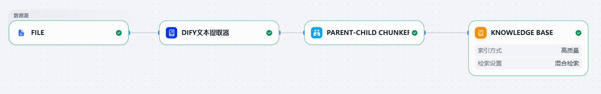
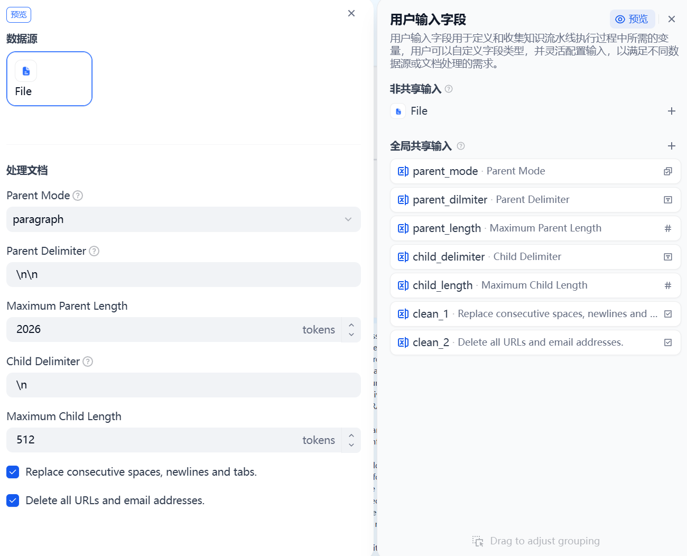

# Zotero-MinerU-Dify Pipeline

[English](README.md)

一个自动化流水线，从 **Zotero** 提取 PDF 附件，通过 **MinerU** 解析为 Markdown，经过**智能分割**处理，最终上传到 **Dify** 知识库，用于 RAG 应用。通过 **Web 界面**管理。

## 架构

```
                        ┌─────────────────────────────────────────┐
                        │           Flask Web 应用                  │
                        │  ┌────────────┐  ┌────────────────────┐ │
  浏览器 ◄──────────────►│  │  REST API   │  │    静态前端          │ │
  (仪表盘 / 配置)        │  │  /api/v1/*  │  │  HTML + Vanilla JS │ │
                        │  └─────┬──────┘  └────────────────────┘ │
                        │        │                                 │
                        │  ┌─────▼──────────────────────────────┐ │
                        │  │       流水线执行器（后台线程）          │ │
                        │  │  Zotero → MinerU → 清洗 → 分割      │ │
                        │  │         → Dify 上传                  │ │
                        │  └────────────────────────────────────┘ │
                        │                                         │
                        │  ┌────────────┐  ┌────────────────────┐ │
                        │  │  运行时配置   │  │    任务管理器        │ │
                        │  │  (JSON)     │  │  (事件流)           │ │
                        │  └────────────┘  └────────────────────┘ │
                        └─────────────────────────────────────────┘
                               │              │             │
                        ┌──────▼──┐   ┌───────▼───┐   ┌────▼─────┐
                        │  Zotero  │   │   MinerU   │   │   Dify   │
                        │  (MCP)   │   │ (解析 API)  │   │(RAG 知识库)│
                        └─────────┘   └───────────┘   └──────────┘
```

## 功能特性

- **Web 仪表盘** — 实时查看流水线进度，支持按文件追踪，轮询式事件流
- **前端配置管理** — 在浏览器中编辑所有设置（API 密钥、分段规则、分割参数），持久化为 JSON
- **智能分割** — 借鉴 [VerbaAurea](https://github.com/AEPAX/VerbaAurea) 的语义感知 Markdown 分割：标题检测、句子边界分析（jieba + NLTK）、多维度评分系统
- **图片摘要回写** — 基于视觉 API 的图片描述生成，将图片占位符替换为上下文相关的文本摘要
- **全链路自动化** — 一键完成从 Zotero 文献库到 Dify 知识库的全流程
- **幂等执行** — 通过 Dify 远程数据集比对实现跳过逻辑，可安全重复运行且不产生重复
- **文件级跳过** — 运行中可在仪表盘跳过单个文件，无需取消整个任务
- **服务连通性测试** — 在配置页面一键验证 Zotero、MinerU、Dify、视觉 API 的连接状态
- **批量处理** — 每个 MinerU 批次最多处理 200 个文件
- **分类筛选** — 支持指定 Zotero 分类（Collection），递归包含子分类
- **Pipeline 文件支持** — 自动发现 Dify 导出的 `.pipeline` 文件，自动应用分段配置
- **多格式支持** — PDF、DOC、DOCX、PPT、PPTX、PNG、JPG、JPEG

## 前置条件

| 依赖 | 版本 | 备注 |
|------|------|------|
| Python | 3.10+ | |
| Zotero | 7.0+ | 需安装 [zotero-mcp](https://github.com/cookjohn/zotero-mcp)插件并运行 |
| MinerU API Token | - | 在 [mineru.net](https://mineru.net) 注册获取 |
| Dify API Key | - | 从 Dify 获取 Dataset API Key |

## 使用教程

首先确保电脑中已经下载安装有：Python 3.10+、Zotero（需要安装 [zotero-mcp](https://github.com/cookjohn/zotero-mcp)）

### 准备工作——Dify

在 Dify 中注册申请一个账号（建议订阅 pro，否则免费版只能上传 50 篇文献且限制库容量为 50MB），在设置中填写好自己的模型，推荐模型配置：


随后创建 Dify 知识库，创建一个带有父子模式的知识库模板的流水线，可按需要选择删除不必要的节点。最简示例：



找到用户输入字段点击预览，必填的处理文档参数如下（<span style="font-weight:bold;">分割字符改为<!--split--></span>）：



然后填写知识库节点的参数，使用高质量索引，嵌入模型推荐选择 Qwen3-Embedding-8B。检索选择混合检索，重排模型推荐使用 Qwen3-Reranker-8B，Top K 和 score 可按需自行配置，配置完成后点击发布流水线，选择导出流水线 pipeline 文件到本地项目目录下。

最后点击服务 API--选择 API 密钥--创建一个新的密钥--复制密钥备用

### 准备工作——MinerU

注册登录使用 [MinerU](https://mineru.net/) 服务--选择 API--点击 API 管理--创建一个新的 token--复制 token 备用

### 开始项目

打开终端，执行以下命令：

```bash
# 克隆仓库
git clone https://github.com/jadechjin/zotero-mineru-dify.git
cd zotero-mineru-dify

# 创建虚拟环境
python -m venv .venv
source .venv/bin/activate   # Linux/macOS
.venv\Scripts\activate      # Windows

# 安装依赖
pip install -r requirements.txt

# （可选）首次启动时自动导入 .env 配置
# 如果 config/runtime_config.json 不存在，Web 界面会自动导入 .env

# 启动 Web 应用
python app.py
# 在浏览器中打开 http://127.0.0.1:5000
```

## 使用方法

1. 在浏览器中打开 `http://127.0.0.1:5000`
2. 进入 **配置** 页面 — 填写 API 密钥（Zotero MCP 地址、MinerU Token、Dify API Key、知识库名称）
3. 使用 **连通性测试** 按钮验证各服务连接
4. 按需调整智能分割、Markdown 清洗和图片摘要设置
5. 进入 **仪表盘** — 输入 Zotero 分组 Key（可选），点击 **启动流水线**
6. 实时监控进度：流水线阶段步进条、事件日志、逐文件状态
7. 运行中可随时 **跳过** 不需要的文件

## 配置说明

### Web 界面（推荐）

所有设置都可以在配置页面编辑。修改保存到 `config/runtime_config.json`，下次运行流水线时生效。

配置分类：**Zotero** | **MinerU** | **Dify** | **Markdown 清洗** | **图片摘要** | **智能分割**

### 环境变量

初始设置或迁移时，通过 `.env` 文件配置。完整模板见 `.env.example`。Web 界面可通过「从 .env 导入」按钮导入配置。

| 变量 | 说明 | 默认值 |
|------|------|--------|
| `ZOTERO_MCP_URL` | Zotero MCP 服务地址 | `http://127.0.0.1:23120/mcp` |
| `MINERU_API_TOKEN` | MinerU API 认证令牌 | - |
| `DIFY_API_KEY` | Dify Dataset API 密钥 | - |
| `DIFY_BASE_URL` | Dify API 基础 URL | `https://api.dify.ai/v1` |
| `DIFY_DATASET_NAME` | 目标知识库名称 | `Zotero Literature` |
| `DIFY_PROCESS_MODE` | 分段策略（`custom` / `automatic`） | `custom` |
| `DIFY_SEGMENT_MAX_TOKENS` | 每个分段最大 Token 数 | `800` |
| `ZOTERO_COLLECTION_KEYS` | 逗号分隔的分类 Key（可选） | - |

## 项目结构

```
zotero-mineru-dify/
├── app.py                          # Flask 入口（Web 界面）
│
├── models/
│   └── task_models.py              # Task, FileState, Event 数据模型
│
├── services/
│   ├── config_schema.py            # 配置 schema、默认值、校验
│   ├── runtime_config.py           # RuntimeConfigProvider（JSON 持久化）
│   ├── task_manager.py             # 线程安全的任务生命周期管理
│   └── pipeline_runner.py          # 后台线程流水线执行
│
├── splitter/                       # 智能分割模块（借鉴 VerbaAurea）
│   ├── md_element_extractor.py     # Markdown → MDElement[] 解析器
│   ├── heading_detector.py         # 标题检测（正则 + Markdown 语法）
│   ├── sentence_boundary.py        # 句子边界检测（jieba + NLTK）
│   ├── split_scorer.py             # 多维度评分系统
│   ├── split_renderer.py           # 插入 <!--split--> 标记
│   └── pipeline.py                 # 编排 5 个子模块
│
├── web/
│   └── routes/
│       ├── health.py               # GET /api/v1/health
│       ├── config_api.py           # 配置 CRUD API
│       ├── tasks_api.py            # 任务管理 API
│       ├── zotero_api.py           # Zotero 代理 API
│       └── services_api.py         # 服务健康检查 API
│
├── templates/
│   └── index.html                  # SPA 主页（Bootstrap 5）
├── static/
│   ├── css/style.css               # 自定义样式
│   └── js/
│       ├── main.js                 # 应用初始化 + 路由
│       ├── dashboard.js            # 仪表盘视图 + 轮询
│       ├── config.js               # 配置编辑器视图
│       ├── api.js                  # API 请求封装
│       └── utils.js                # Toast 通知、工具函数
│
├── zotero_client.py                # Zotero MCP 客户端
├── mineru_client.py                # MinerU API 客户端
├── dify_client.py                  # Dify API 客户端
├── md_cleaner.py                   # Markdown 清洗 + 图片摘要
├── requirements.txt                # Python 依赖
├── .env.example                    # 环境变量模板
├── docs/
│   ├── CONTRIB.md                  # 开发贡献指南
│   └── RUNBOOK.md                  # 运维手册
└── config/
    └── runtime_config.json         # 运行时配置（自动生成）
```

## API 端点

| 方法 | 端点 | 说明 |
|------|------|------|
| GET | `/api/v1/health` | 健康检查 |
| GET | `/api/v1/config` | 获取当前配置（脱敏） |
| PUT | `/api/v1/config` | 更新配置 |
| GET | `/api/v1/config/schema` | 获取配置 Schema |
| POST | `/api/v1/config/import-env` | 从 .env 文件导入 |
| POST | `/api/v1/config/reset` | 重置为默认值 |
| POST | `/api/v1/tasks` | 创建流水线任务 |
| GET | `/api/v1/tasks` | 列出所有任务 |
| GET | `/api/v1/tasks/:id` | 获取任务详情 |
| GET | `/api/v1/tasks/:id/events?after_seq=N` | 获取增量事件 |
| GET | `/api/v1/tasks/:id/files` | 获取逐文件状态 |
| POST | `/api/v1/tasks/:id/cancel` | 取消运行中的任务 |
| POST | `/api/v1/tasks/:id/files/:filename/skip` | 运行中跳过指定文件 |
| GET | `/api/v1/zotero/health` | 检查 Zotero MCP 连接 |
| GET | `/api/v1/zotero/collections` | 列出 Zotero 分组 |
| GET | `/api/v1/mineru/health` | 检查 MinerU API 连接 |
| GET | `/api/v1/dify/health` | 检查 Dify API 连接 |
| GET | `/api/v1/image-summary/health` | 检查视觉 API 连接 |

## 工作原理

1. **配置** — 通过 Web 界面设置 API 密钥和偏好，使用内置健康检查验证连接
2. **收集** — 通过 MCP 查询 Zotero，获取附件文件路径，可按分类筛选；跳过已上传到 Dify 的项目（异常/禁用状态的文档会自动重新处理）
3. **解析** — 将文件批量上传到 MinerU API，轮询等待完成，下载生成的 Markdown
4. **清洗** — 应用 Markdown 清洗规则（去除 HTML、压缩空行、移除占位符）
5. **图片摘要** — 通过视觉 API 将图片占位符替换为 AI 生成的文本描述
6. **智能分割** — 分析文档结构，检测标题和句子边界，多维度评分最优分割点，插入 `<!--split-->` 标记
7. **上传** — 提交文档到 Dify；文件在成功提交后即视为完成（索引在 Dify 中异步进行）

## 文档

- [docs/CONTRIB.md](docs/CONTRIB.md) — 开发贡献指南，包含完整环境变量参考
- [docs/RUNBOOK.md](docs/RUNBOOK.md) — 运维手册：部署、监控、故障排查

## 许可证

MIT
